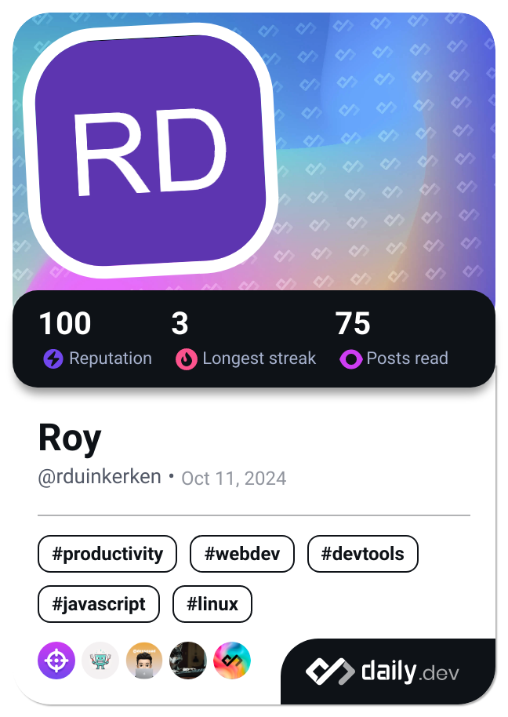

## Hello! 👋
My name is Roy, I am a Software Engineering student at Windesheim University of Applied Sciences.

Find more about my experiences on my LinkedIn

  <a href="https://www.linkedin.com/in/roy-duinkerken-470497208/" target="_blank" rel="noreferrer"> <picture> <source media="(prefers-color-scheme: dark)" srcset="https://raw.githubusercontent.com/danielcranney/readme-generator/main/public/icons/socials/linkedin-dark.svg" /> <source media="(prefers-color-scheme: light)" srcset="https://raw.githubusercontent.com/danielcranney/readme-generator/main/public/icons/socials/linkedin.svg" />  </picture> </a>

## Familiarities

 ---

## Projects

### Work
- 📦 **Product Management Web Application**
  - Tech Stack: PHP, JavaScript, MySQL, CSS
  
- 📱 **Certificates App ([iOS](https://apps.apple.com/nl/app/pasjesapp-tweb/id6451257079) & [Android](https://play.google.com/store/search?q=pasjesapp%20tweb&c=apps&hl=nl))**
  - Tech Stack: React Native, Express.js, MySQL

- 🔨 **Building a new Webapplication to manage businessprocesses and documents**
  - Tech Stack: Vue, TypeScript, MongoDB, Express.js
  
### Personal (Fun & Experimental)
- 🕰️**Pomodoroy** - [Pomodoro timer!](https://pomodoroy.royduinkerken.nl)
  - Tech Stack: Vue (overkill but that's ok), TypeScript, CSS

_not working on this currently_
- 📊 **In-Game Character Statistics Web Application**
  - Tech Stack: TypeScript, HTML, CSS

  _not working on this currently_
- 🎮 **Avoidance Platform Game**
  - Tech Stack: Unity

---

_vim enthousiast btw 😉_

 

I also like to stay updated and read articles about software engineering and other stuff.

